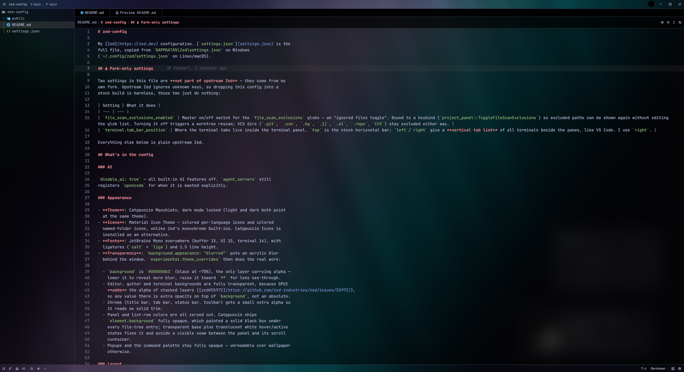

# zed-config



My [Zed](https://zed.dev) configuration. [`settings.json`](settings.json) is the
full file, copied from `%APPDATA%\Zed\settings.json` on Windows
(`~/.config/zed/settings.json` on Linux/macOS).

## Fork-only settings

> [!IMPORTANT]
> Four settings in this file are **not part of upstream Zed** — they come from
> my own [fork](https://github.com/YoGoUrT20/zed). Upstream Zed ignores unknown
> keys, so dropping this config into a stock build is harmless; those four
> just do nothing.

| Setting | What it does |
| --- | --- |
| `file_scan_exclusions_enabled` | Master on/off switch for the `file_scan_exclusions` globs — an "ignored files toggle". Bound to a keybind (`project_panel::ToggleFileScanExclusions`) so excluded paths can be shown again without editing the glob list. Turning it off triggers a worktree rescan; VCS dirs (`.git`, `.svn`, `.hg`, `.jj`, `.sl`, `.repo`, `CVS`) stay excluded either way. |
| `terminal.tab_bar_position` | Where the terminal tabs live inside the terminal panel. `top` is the stock horizontal bar; `left`/`right` give a **vertical tab list** of all terminals beside the panes, like VS Code. I use `right`. |
| `tabs.show_parent_directory` | Always prints the parent directory under the file name on a tab. Stock Zed only adds that subtitle to disambiguate when two open tabs share a file name; this pins it on for every tab. |
| `tabs.active_tab_accent` | Draws a 2px gradient strip along the top edge of the active tab, running from the theme's `text.accent` to its first player cursor color. On a theme where those two are the same hue (Catppuccin Macchiato, for one) it reads near-monotone — override `text.accent` to get a visible ramp. |

Everything else below is plain upstream Zed.

## What's in the config

### Updates

`auto_update: false` — this is a fork build, so the official updater must not
overwrite `Zed.exe`.

### AI

`disable_ai: true` — all built-in AI features off. `agent_servers` still
registers `opencode` for when it is wanted explicitly.

### Appearance

- **Theme**: Catppuccin Macchiato, dark mode locked (light and dark both point
  at the same theme). The fork also bundles a **Cyber Glass** theme (near-black
  editor, purple/cyan accents) built to pair with the two tab settings above.
- **Icons**: Material Icon Theme — colored per-language icons and colored
  named-folder icons, unlike Zed's monochrome built-ins. Catppuccin Icons is
  installed as an alternative.
- **Fonts**: JetBrains Mono everywhere (buffer 15, UI 15, terminal 14), with
  ligatures (`calt` + `liga`) and 1.5 line height.
- **Transparency**: `background.appearance: "blurred"` puts an acrylic blur
  behind the window. `experimental.theme_overrides` then does the real work:

  - `background` is `#000000b3` (black at ~70%), the only layer carrying alpha —
    lower it to reveal more blur, raise it toward `ff` for less see-through.
  - Editor, gutter and terminal backgrounds are fully transparent, because GPUI
    **adds** the alpha of stacked layers ([zed#55972](https://github.com/zed-industries/zed/issues/55972)),
    so any value there is extra opacity on top of `background`, not an absolute.
  - Chrome (title bar, tab bar, status bar, toolbar) gets a small extra alpha so
    it reads as solid trim.
  - Panel and list-row colors are all zeroed out. Catppuccin ships
    `element.background` fully opaque, which painted a solid black box under
    every file-tree entry; transparent base plus translucent white hover/active
    states fixes it and avoids a visible seam between the panel and its scroll
    container.
  - **`panel.overlay_background` is the one panel color that must stay opaque**
    (`#0c0c0cff`). It backs the sticky/pinned parent-folder rows at the top of
    the file tree, which float *over* the entries scrolling underneath — zero it
    and the file names bleed straight through them. Zed normally derives it as
    an opaque `panel.background`, so the transparency only appears once it is
    overridden by hand.
  - `panel.overlay_hover` stays translucent (`#ffffff14`) on purpose: the
    editor's multibuffer header paints it as a real overlay quad. The fork
    composites it over the opaque overlay background in the project panel
    instead of replacing it, so the sticky rows stay solid on hover.
  - Popups and the command palette stay fully opaque — unreadable over wallpaper
    otherwise.

### Layout

- **Project panel** on the left, 280px, comfortable spacing, file icons, git
  status, indent guides always on, sticky scroll, auto-reveal, auto-fold dirs,
  all diagnostics shown.
- Outline, git and collaboration panels all docked left too, so they don't
  compete with the file tree for space. Agent panel right, 420px.
- **Terminal** docked bottom, 320px tall, tabs on the right (fork setting above).
- **Tab bar**: nav history buttons and the right-side button group (new file,
  split, zoom) both hidden. The actions still work by keybind:

  | Action | Keybind |
  | --- | --- |
  | Navigate back / forward | `ctrl--` / `ctrl-shift--` |
  | Split pane | `ctrl-k ctrl-\` |
  | Zoom pane | `ctrl-k z` |

### File scanning

`file_scan_exclusions` **replaces** Zed's defaults rather than extending them,
so the built-in entries are repeated in the list. On top of those: Python
caches and venvs, Node/pnpm/yarn dep dirs, and bundler output
(`.next`, `dist`, `build`, `out`, `.turbo`, `.vercel`, `.svelte-kit`, `.cache`,
`coverage`). Excluded paths are skipped at scan time, so they vanish from
search and the file finder too — not just the tree. Delete a line to bring a
folder back, or flip the fork toggle to bring them all back at once.

### Editing

- `base_keymap: "VSCode"`.
- Autosave after 1s idle.
- `session.trust_all_worktrees` — no trust prompt per project.
- Format on save for Java and Kotlin, tab size 4.

### Language servers

`jdtls` is pointed at Temurin JDK 25 via `java_home` (it needs 21+), with Lombok
support, organize-imports on save, and incomplete-classpath downgraded to a
warning. Kotlin uses JetBrains' `kotlin-lsp` by default; swap in the community
server with `["kotlin-language-server", "!kotlin-lsp", "..."]` if it misbehaves.

Diagnostics for both come from the language server, so the
`auto_install_extensions` entries (`java`, `kotlin`) are what actually turn them
on. Note that `auto_install_extensions` is pulled from the registry at
**startup**, not on settings reload.

## Usage

Copy `settings.json` over your own:

```bash
# Windows
cp settings.json "$APPDATA/Zed/settings.json"

# Linux / macOS
cp settings.json ~/.config/zed/settings.json
```
